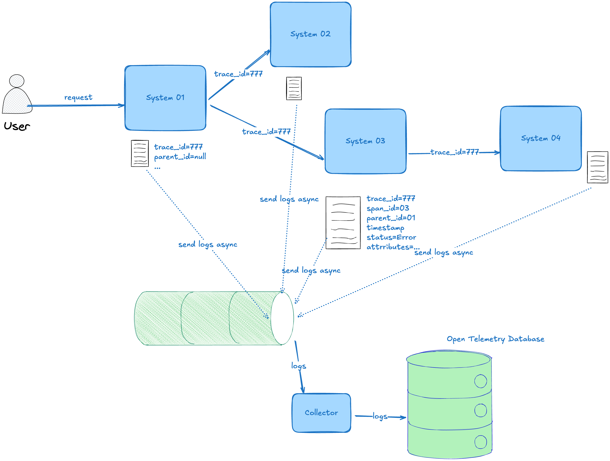
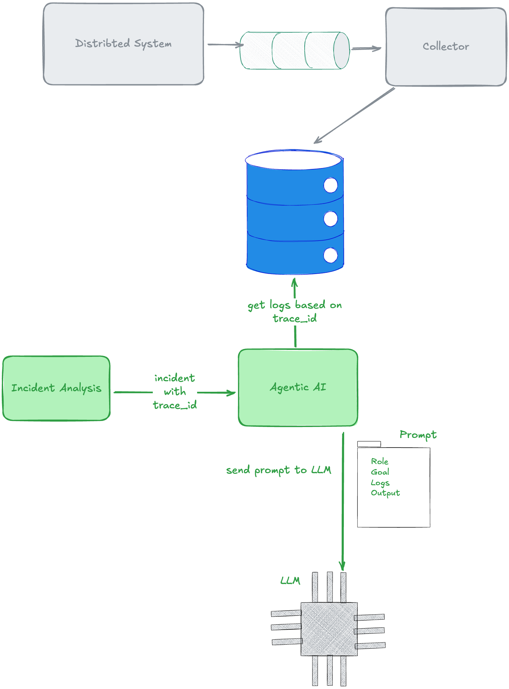

# Agentic AI Observability

## Introduction

This thesis investigates how agent-based systems can perform root cause localization using observability data (logs, metrics, traces) following the OpenTelemetry standard. Using Google’s ADK and the OpenTelemetry demo application, you will design an agent that collects and reasons over telemetry data to propose likely root causes for incidents.

The research focus is on comparing different approaches to fusing multi-modal telemetry and exploiting service-dependency graphs, and on benchmarking an agentic approach against simpler correlation-based or rule-based baselines. You will run controlled fault-injection experiments, measure root cause ranking accuracy, and analyze robustness under noisy or incomplete telemetry.

This project is the most interesting in my opinion, but also requires the most work, since it also requires having built a root cause process that the agent can fetch information from. It also requires that you set up data storage/structure to handle all the telemetry data. Our team can support you in building parts of the project that you don’t think you’ll have time for.

## Observability with OpenTelemetry in Distributed Systems


### Overview
OpenTelemetry is an open-source observability framework that provides a standardized way to collect, process, and export telemetry data (traces, metrics, and logs) from distributed systems. It enables developers to gain insights into the performance and behavior of their applications, making it easier to diagnose issues and optimize performance.

### Architecture Components

### Logging Mechanism
1. When a request comes to system, a unique trace ID is generated to track the request across all services.
2. Each service (or span) involved in processing the request logs relevant information, including the trace ID, span_id, parent_id, status (OK, ERROR), timestamps, attributes and events.
3. Each service exports the collected telemetry data to a centralized database (preferably asynchronously) for storage and analysis.

### Telemetry Data Types
1. **Traces**: Represent the end-to-end journey of a request as it flows through various services. Each trace consists of multiple spans, each representing a unit of work within a service.
2. **Metrics**: Quantitative measurements that provide insights into the performance and health of services
3. **Logs**: Textual records that capture events and state changes within services, often used for debugging and auditing.
...

### Sample Trace Data
According to the OpenTelemetry documentation, a sample trace data in JSON format looks like this:
```json
{
  "name": "hello-greetings",
  "context": {
    "trace_id": "5b8aa5a2d2c872e8321cf37308d69df2",
    "span_id": "5fb397be34d26b51"
  },
  "parent_id": "051581bf3cb55c13",
  "start_time": "2022-04-29T18:52:58.114304Z",
  "end_time": "2022-04-29T22:52:58.114561Z",
  "attributes": {
    "http.route": "some_route2"
  },
  "events": [
    {
      "name": "hey there!",
      "timestamp": "2022-04-29T18:52:58.114561Z",
      "attributes": {
        "event_attributes": 1
      }
    },
    {
      "name": "bye now!",
      "timestamp": "2022-04-29T18:52:58.114585Z",
      "attributes": {
        "event_attributes": 1
      }
    }
  ]
}
```

### OpenTelemetry Database
Database should be able to store large volumes of telemetry data with high availability and scalability.
Database should support efficient querying and analysis of telemetry data.


## Discover root cause of an Incident (by Human)
1. Use trace IDs to follow the request path across services.
2. Query the database for logs, metrics, and traces associated with the trace ID.
3. Draw a service dependency graph to visualize interactions between services (with parent_id).
4. Analyze the collected data to identify root causes of issues and errors.

## Discover root cause of an Incident (by AI Agent)
1. Use trace IDs to follow the request path across services.
2. Create a prompt with the trace ID and relevant context.
A simple prompt template could be:
   ```shell
    Agent Role: You are an AI agent specialized in analyzing distributed system telemetry data.
    Task: Investigate the root cause of an incident using the provided trace ID.
    Trace ID: <trace_id>
    Logs: <logs associated with trace_id>
    Metrics: <metrics associated with trace_id>
    Traces: <traces associated with trace_id>
    Service Dependency Graph: <service dependency graph> 
    Output Format: Provide a detailed analysis of the root cause, affected services, and recommended actions to resolve the incident.
   ```
3. Send the prompt to the AI agent for analysis.
4. Agentic AI send the prompt to LLM for processing.
5. LLM processes the prompt and generates a response with the root cause analysis.
6. The AI agent reviews the LLM response and formats it for human consumption.
7. The AI agent presents the analysis to human operators for further action.

## Agentic AI Architectural Components


## Agentic AI Challenges and Considerations
1. Get logs, metrics, and traces associated with trace IDs efficiently.
2. Discovering relevant telemetry data from large datasets based on trace IDs.
3. Context management to ensure the AI agent has sufficient information for analysis.
4. Handling multi-modal data (logs, metrics, traces, dashboards, images, and ...) effectively.
5. Ensuring the accuracy and reliability of the AI agent's analysis.
6. Evaluating the performance of the AI agent against traditional root cause analysis methods.
7. Dealing with noisy or incomplete telemetry data.
8. Fine-tuning the LLM for domain-specific knowledge in distributed systems and observability.

## Security and Privacy Considerations
1. Ensure that sensitive telemetry data is handled securely and in compliance with privacy regulations.
2. Following GDPR and other relevant data protection laws when processing telemetry data.
3. Encrypting sensitive data during transmission and storage.

## Evaluation Strategy
1. Conduct controlled fault-injection experiments to create incidents in the distributed system.
2. Measure the accuracy of root cause ranking by comparing the AI agent's analysis with known root causes.
3. Analyze the robustness of the AI agent under noisy or incomplete telemetry data.
4. Compare the performance of the agentic approach against simpler correlation-based or rule-based baselines.
5. Collect feedback from human operators on the usefulness and clarity of the AI agent's analysis.

## Conclusion
This thesis explores the potential of agent-based systems to perform root cause localization in distributed systems using observability data. By leveraging OpenTelemetry and advanced AI techniques, the research aims to enhance the efficiency and accuracy of incident analysis, ultimately improving system reliability and performance.

